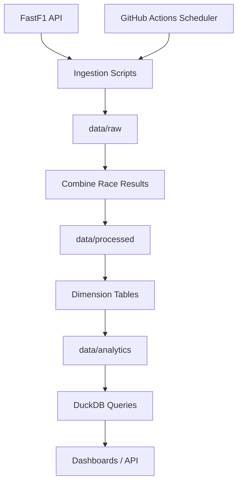

# F1 Analytics Data Pipeline

```mermaid
flowchart TD

A[FastF1 API] --> B[Ingestion Scripts]

B --> C[data/raw]

C --> D[Combine Race Results]

D --> E[data/processed]

E --> F[Dimension Tables]

F --> G[data/analytics]

G --> H[DuckDB Queries]

H --> I[Dashboards / API]

J[GitHub Actions Scheduler] --> B
```